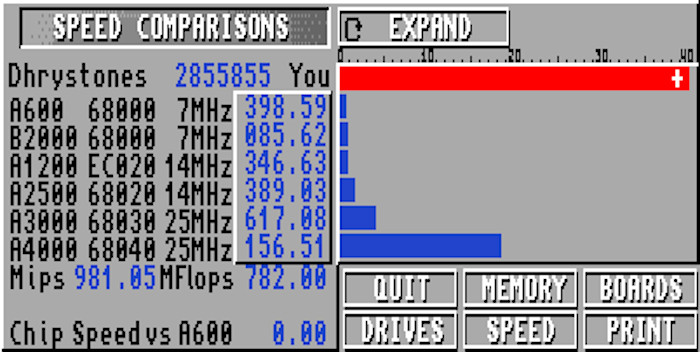
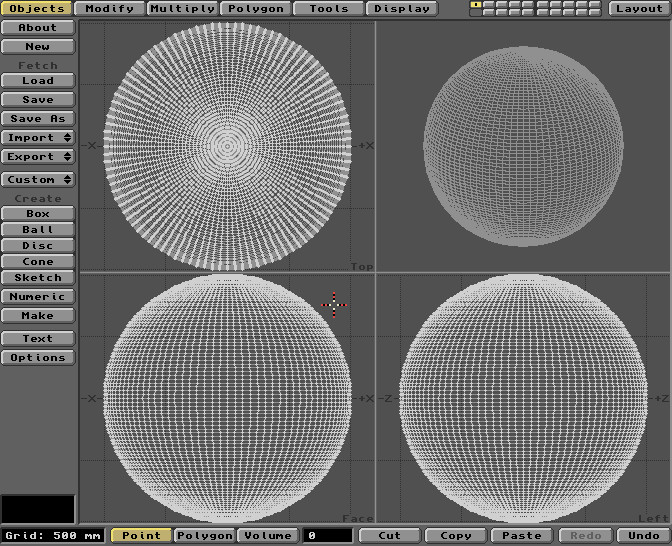
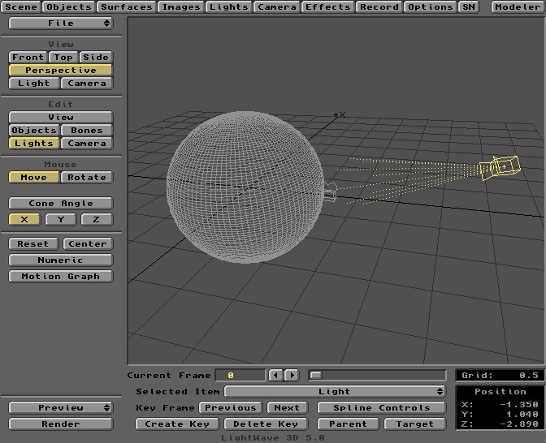
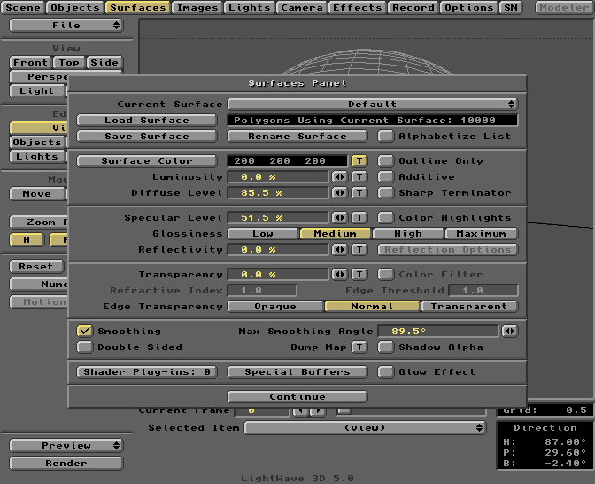

I recently found myself in need of an Amiga-inspired avatar. The Boing Ball seemed an obvious choice. Made famous by a [1984 CES demo](https://www.youtube.com/watch?v=YlAhRJjOhDg), the Boing Ball set the scene for Amiga's dominance in real-time graphics and OS multitasking. Here's a short [deconstruction](https://amiga.lychesis.net/artist/DaleLuck/Boing.html) of how the effect worked.

Briefly revisiting the venerable Amiga ray tracer Imagine 3D, the nostalgia was strong. My younger self spent many hours modeling, texturing, and rendering scenes in Imagine. The user interface was not very intuitive, though. I decided to try something a little more modern.

# Lightwave 3D

Newtek's Lightwave 3D was a ray tracing package originally shipped with their popular [Video Toaster](https://arstechnica.com/gadgets/2016/03/a-history-of-the-amiga-part-9-the-video-toaster/) hardware. The Toaster was expensive and required a powerful Amiga, mostly limiting its use to professional users of the time. Emulation has made this tool much more accessible to retro enthusiasts.



The FS-UAE configuration I am using includes the following options:

```
amiga_model = A1200
cpu = 68040-NOMMU
jit_compiler = 1
```

The FS-UAE build must include JIT support. The Arch Linux package [disables JIT](https://git.archlinux.org/svntogit/community.git/tree/trunk/PKGBUILD?h=packages/fs-uae), which tripped me up. I chose to build FS-UAE from source instead. The binary download also includes JIT support.

I installed the Lightwave package **LW50r_Incl.CDContent.lha** and downloaded the manual **Video.Toaster.4000_LW5-Manual.pdf**. Both of these can be found on the EAB FTP.

Lightwave consists of two separate programs: Modeler and Layout. I started out in Modeler to create the Boing Ball mesh.

# Modeler



At first glance the Modeler seems a bit spartan. This is where all mesh editing is done and I expected to see a little more. However, the buttons along the top switch in different panels on the left. Several buttons also conceal pop-up windows. There's a lot more going on here.

I clicked the button conveniently named Ball and drew out a square in the top and side views with Ctrl-Click-Drag. The Numeric button pops up a window to set the number of sides and vertical segments. I set these to 100 to get a reasonably spherical mesh. I could not find an option for non-polygonal spheres.

Our brief stop by the Modeler is complete. The object can now be saved out for loading into the Layout program.

# Layout



Positioning objects, lighting, texturing, and rendering are all done in the Layout program. This has a reasonably intuitive interface with a few quirks. Notably, saving the "scene" does not save all of the state. Surfaces and objects must also be saved separately.

I started by placing the camera very close to the ball and expanding its field of view. I wanted a slightly distorted look to match the original demo. Next I changed the default light source to a spotlight and aimed it at the ball. Aligning this was tricky. In hindsight a point light source might have sufficed.


I created a checkerboard texture for the ball in Personal Paint. This texture is loaded into Layout through the Images menu and applied to an object through the Surfaces menu. Surfaces define how objects interact with light sources. Here, we can also adjust the texture size, alignment, and wrapping.



Once things were roughly set up I was ready to preview the render. On a real Amiga you would normally render at a low resolution for this step. In an emulator we can render this scene at full resolution in just a couple of seconds. Very handy! I dialled back antialiasing as this is a little slow for previews.

Previews are shown in 8-bit [HAM mode](https://en.wikipedia.org/wiki/Hold-And-Modify) by default. If you're unfamiliar with HAM mode it can take a little practice to separate fringing artifacts from the underlying picture. I was OK with this, but if you configure emulation for Picasso II display then Lightwave should be able to preview in full 24-bit color.

Next I spent an hour or two experimenting with the settings to get the picture just right. This was mostly due to my lack of experience with ray tracing. Once I was happy with the result I set up the final render to disk. Lightwave has a suite of features for creating animations, but I just needed a single frame.


# Composition

The Lightwave render consists of two files: 24-bit RGB and 8-bit alpha ILBM images. The alpha channel defines transparency in the color image. This would normally be used for compositing a foreground and background image, or to overlay a rendered animation onto video.

In my case I wanted a 32-bit PNG with transparency to use on the web. I was unable to locate an Amiga program which could output this. Instead I cheated a little and used Imagemagick with the following command:

```
convert rgb.iff alpha.iff -alpha off -compose copy_opacity \
-composite output.png
```

The result can be seen at the [top of this post](#)! It also now has pride of place as this website's favicon and my GitHub avatar. I'm quite chuffed with the result. I hope to do some more complex renders in the future!