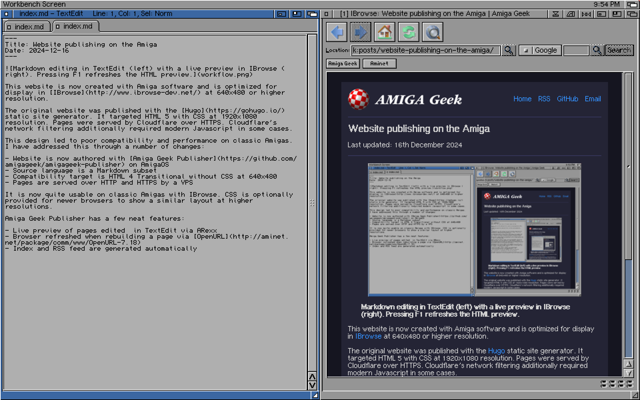

This website is now created with Amiga software and is optimized for display in [IBrowse](http://www.ibrowse-dev.net/) at 640x480 or higher resolution.

The original website was published with the [Hugo](https://gohugo.io/) static site generator. It targeted HTML 5 with CSS at 1920x1080 resolution. Pages were served by Cloudflare over HTTPS. Cloudflare's network filtering additionally required modern Javascript in some cases.

This design led to poor compatibility and performance on classic Amigas. I have addressed this through a number of changes:

- Website is now authored with [Amiga Geek Publisher](https://github.com/amigageek/amigageek-publisher) on AmigaOS
- Source language is a Markdown subset
- Compatibility target is HTML 4 Transitional without CSS at 640x480
- Pages are served over HTTP and HTTPS by a VPS

It is now quite usable on classic Amigas with IBrowse. CSS is optionally provided for newer browsers to show a similar layout at higher resolutions.

Amiga Geek Publisher has a few neat features:

- Live preview of pages edited  in TextEdit via ARexx
- Browser refreshed when rebuilding a page via [OpenURL](http://aminet.net/package/comm/www/OpenURL-7.18)
- Index and RSS feed are generated automatically