# Top-Level Diagram

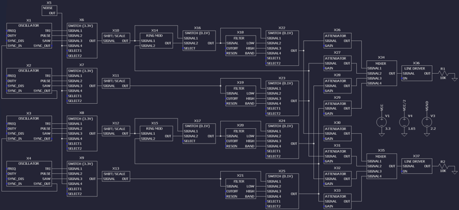

A [full-size image](toplevel_full.png) is available for easier reading.

The analog hardware is divided into four audio channels. Channels produce independent sounds in stereo.

Each channel is identical with the exceptions of ring modulation and oscillator synchronization circuits. These are present on channels 1 and 3 only. Channels 2 and 4 provide a modulation or synchronization signal while channels 1 and 3 output the effect.

The overall flow follows a standard subtractive synthesizer design: oscillator, filter, attenuator. All four channels are mixed together to drive line-level stereo audio through a 3.5mm jack.

# Reference Voltages

Circuit power is drawn from a unipolar supply at a nominal 5V. The primary power source is USB. An external source may be connected to the 5V/GND pins by moving a jumper.

The input voltage is regulated to 3.3V for both digital and analog circuits. This reduces power consumption and simplifies component selection. Analog circuits are calibrated with respect to this reference voltage. 

Analog circuits use two different virtual grounds: VCC/2 (1.65V) and VGND (2.2V). VCC/2 is ground for high dynamic range 3.3Vpp signals in the oscillator. VGND is used throughout the design to provide headroom for FET gate-source saturation. Signals referenced to VGND have a much lower amplitude, at 100mVpp.

# Triangle Oscillator

The primary oscillator outputs a triangle wave with a voltage-controlled frequency. Its design is a [relaxation oscillator](https://en.wikipedia.org/wiki/Relaxation%20oscillator) driven by a [Schmitt trigger](https://en.wikipedia.org/wiki/Schmitt%20trigger).

Op amp X1 and capacitor C1 form an [integrator](https://en.wikipedia.org/wiki/Op%20amp%20integrator) whose output rises and falls at a rate proportional to input voltage VFREQ. Current flow through C1 is constant in magnitude with direction reversed by MOSFET M1 switching on and off.

M1 is driven by a Schmitt trigger formed by comparator X2 and resistors R6 and R7. Its output is a square wave which inverts when the triangle wave is within 1% of either voltage rail. Hysteresis provides stability when the comparator inputs are close in voltage.

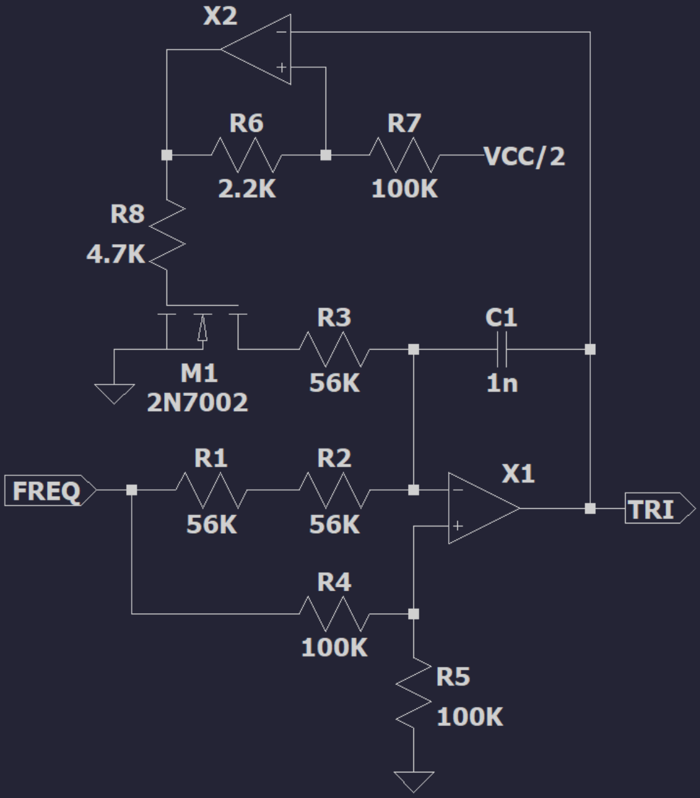

X1 inputs are held at voltage VFREQ/2 by the divider formed by R4 and R5.

When M1 is switched off the current flowing through C1 is controlled by R1 and R2. By Ohm's law:

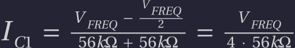

When M1 is switched on the current through R3 is twice in magnitude:

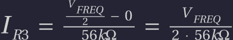

The current in C1 has the same magnitude as before but its direction is reversed. By Kirchoff's first law:

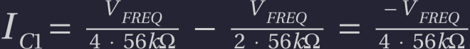

The negligible channel resistance of MOSFET M1 is important for waveform symmetry. Voltage drop across a BJT would skew the triangle wave.

Capacitor C1 has the following voltage-current relationship when VFREQ is constant:

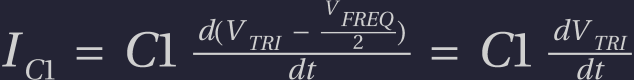

Integrating both sides with respect to dt, from minimum to maximum VTRI:

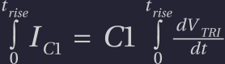

Substituting C1 current from earlier, independent of dt, and VTRI in [0, VCC]:

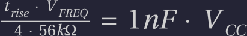

The triangle wave period includes both rise and fall times:

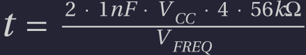

Its frequency varies linearly with input voltage VFREQ:

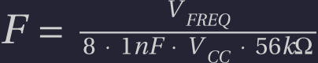

Maximum frequency is obtained when VFREQ = VCC:

The frequency range used by software covers musical notes C-1 (32Hz) through B-6 (1975Hz). The remaining headroom tolerates small variation in component values.

# Sawtooth Oscillator

A sawtooth wave is derived from the output of the triangle oscillator.

The triangle wave is attenuated and biased into the range [VCC/2, VCC] by the voltage divider formed by R14 and R15. This waveform, buffered by op amp X4, is then inverted around VCC/2 in one half of the cycle by op amp X5. A discontinuity forms at VCC and 0V.

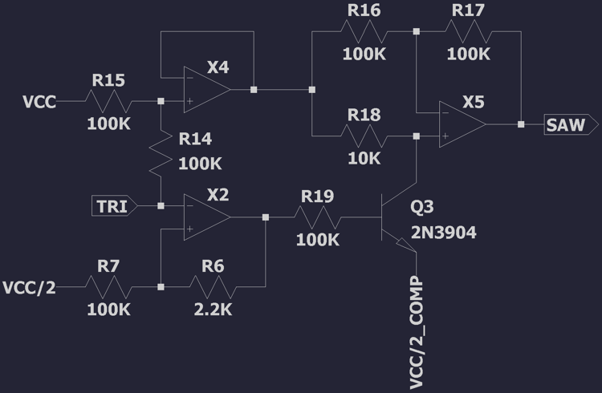

BJT Q3 is driven by the [triangle oscillator](#triangle_oscillator)'s Schmitt trigger X2. This outputs a square wave, switching Q3 on and off in the two halves of the cycle.

When Q3 is switched off op amp X5 "inverts" the signal around itself, passing the waveform through unchanged.

When Q3 is switched on op amp X5 inverts the signal around VCC/2. To compensate for the small voltage drop across Q3 an appropriately biased voltage is connected to the emitter.

# Pulse Oscillator

A pulse wave with voltage-controlled pulse width is derived from the output of the triangle oscillator.

Comparator X6 outputs a pulse wave which inverts when the triangle wave crosses control voltage VWIDTH. The control voltage narrows or widens the pulse. At VCC/2 the output is a square wave.

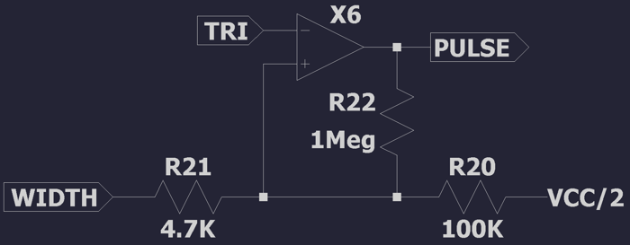

The voltage divider formed by R20 and R21 limits the minimum and maximum pulse width to 5% and 95%. VWIDTH varies from 0V to VCC. R22 adds a small amount of hysteresis to improve stability when the triangle wave is close to the control voltage.

# Oscillator Synchronization

The triangle, sawtooth, and pulse oscillators can be synchronized with an external square wave. When a rising edge is observed the oscillator resets to the beginning of its cycle.

SUSY's four channels, each with a set of oscillators, are arranged into two pairs. The first channel of each pair can synchronize with the second. The synchronization square wave is the output of the [triangle oscillator](#triangle_oscillator)'s Schmitt trigger X2, with a frequency equal to that of the oscillator.

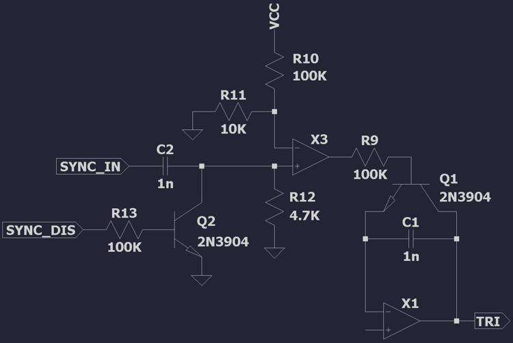

Synchronization works by discharging the [triangle oscillator](#triangle_oscillator)'s integrator capacitor C1 through the emitter/collector of Q1. When Q1 is switched off oscillation proceeds normally. When Q1 is switched on C1 rapidly discharges, driving oscillator output to DC. Oscillation resumes from the beginning of the cycle when Q1 switches off again.

For synchronization to work well it is important to discharge C1 and resume oscillation as quickly as possible, while respecting current design limits. Q1 is driven by a short pulse wave generated by comparator X3.

Rising and faling edges of the square wave VSYNC_IN are detected by the high-pass filter formed by C2 and R12. This has a cutoff tuned for the desired pulse duration:

Comparator X3 detects rising edges by comparing the filtered square wave with a slightly positive voltage. Filtered falling edges have negative voltage.

Additional input VSYNC_DIS allows the rising and falling edges to be suppressed when synchronization is disabled. When Q2 is switched on the filter's cutoff is greatly increased, driving X3's output to 0V, which switches Q1 off.

# Noise Generator

A wideband noise audio source complements the three oscillators. Voltage reference diode D1 is driven at its minimum operating current, where voltage noise is maximum at about 60uV. This noise is amplified by transistor Q1 and three cascaded op amps.

Op amps X1-X3 have a GBP of 1.2MHz. Each amplifier is configured for a gain of 50, limiting the noise bandwidth to about 24kHz.

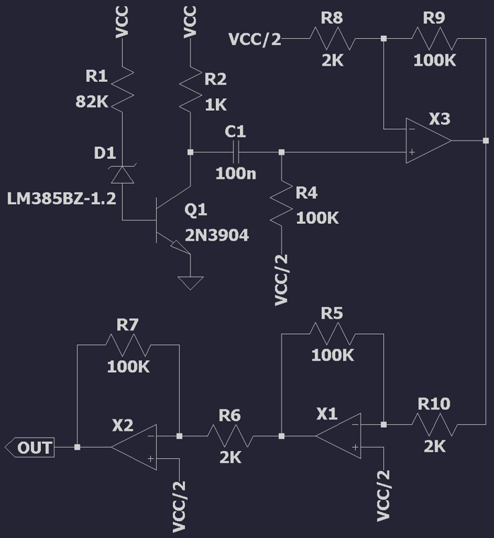

The high-pass filter formed by capacitor C1 and R4 recenters ground to VCC/2. In theory precise selection of R2 could achieve the same result but in practice the precision required is too high.

# Oscillator Switch

Outputs of the three oscillators and noise generator are multiplexed through a 4-way switch. The switch accepts two digital control signals. Together these select one of the signal inputs (0, 1, 2, 3) to output.

The 4-way switch is constructed from three pairs of 2-way switches. The first pair multiplexes signals 0 and 1. The second pair multiplexes signals 2 and 3. The third pair multiplexes the output of the first two switches.

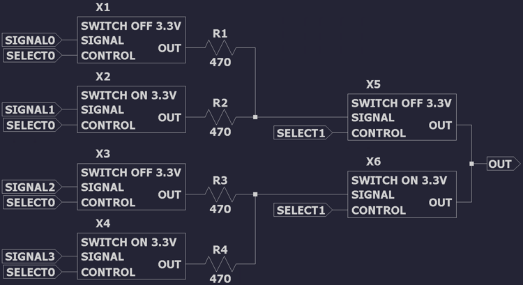

Each 2-way switch is constructed from a pair of on/off switches. The outputs of each switch have low impedance when switched on and high impedance when switched off. Resistors R1-4 reduce momentary conduction as the control signals transition between low and high.

The "switch off" design uses a pair of BJTs, Q2 and Q3, to fully suppress or conduct the input signal. Q2 conducts signals close to 0V and Q3 conducts signals close to VCC. Both conduct when the signal is not close to either rail.

BJT Q1 inverts the control signal to drive Q2. This ensures that both NPN and PNP transistors are switched on or off in unison.

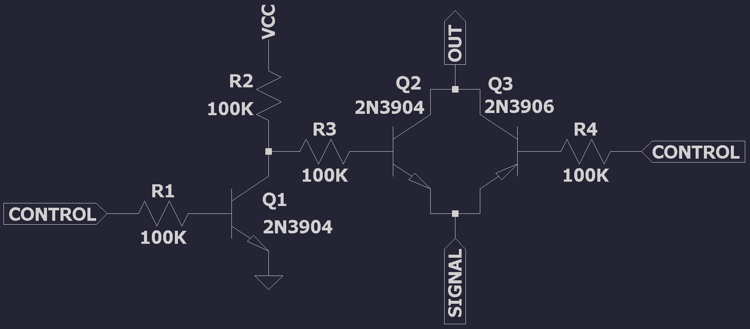

The "switch on" design is a mirror of the "switch off design".

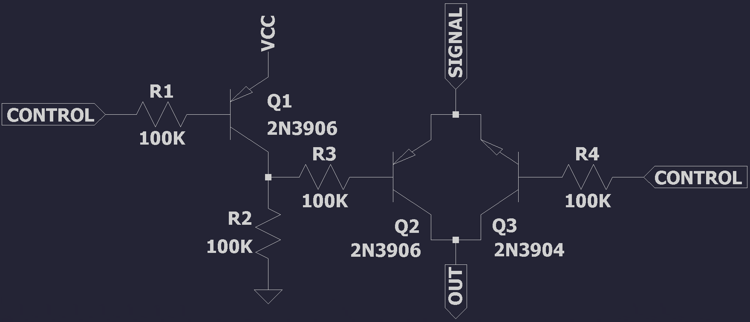

# Signal Offset and Attenuator

Signals leaving the oscillator switch are rescaled from the range [0V, VCC] into [2.15V, 2.25V], centered on VGND. This allows them to conduct through FETs while providing enough gate-source headroom for saturation. VGND is biased towards VCC because JFETs require a large negative gate-source voltage.

This is achieved with the op-amp configuration shown below.

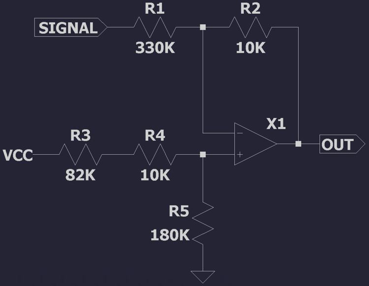

To analyze the signal transformation first equate currents in the top branch, with V' at the op amp inputs:

Multiply both sides by R2 and rearrange:

Next analyze current in the lower branch:

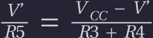

Multiply both sides by (R3 + R4) and rearrange:

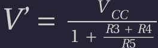

Substitute V' into earlier equation and rearrange:

The two components of this equation represent a voltage offset and a voltage scale with inversion. Note that the scale is centered on 0V and not VCC/2.

Resistor ratios can then be expressed in terms of offset and scale:

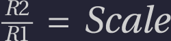

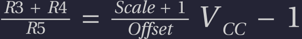

Our desired scale and offset factors are as follows. Note that voltage offset is applied after signal inversion, with 0V mapping to 2.25V:

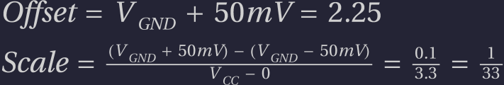

The chosen resistor values precisely match these ratios.

# Ring Modulator

[Ring modulation](https://en.wikipedia.org/wiki/Ring_modulation) is an audio effect which performs a signed multiplication of two signals. SUSY allows pairs of channels to engage in ring modulation, multiplying their oscillators together. This is optional and a switch provides a bypass in the common case.

The circuit is based heavily on a [published design](https://ednasia.com/easy-four-quadrant-multiplier-using-a-quad-op-amp). A critical property of the input signals is that they are small signals, i.e. their peak-to-peak is much smaller than their DC offset. This is one reason for attenuating signals as they leave the oscillator switch.

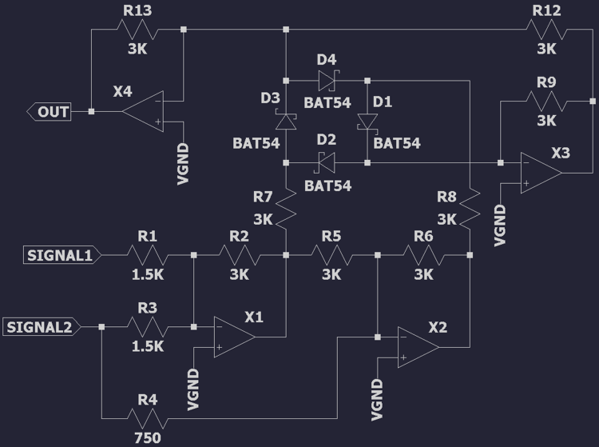

Its overall function is based on a mathematical relation equating multiplication to a summation of squared terms:

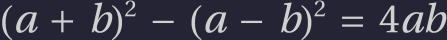

The unsquared terms are easily calculated using op amps X1 and X2. They are negated and pre-scaled, to compensate for later constant gain terms in the circuit, but otherwise suitable.

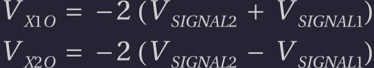

Squaring and subtracting these terms is achieved through exponential amplifiers X3 and X4. For the moment consider a single diode from the ring, forward-biased and carrying the small signal, in series with one op amp:

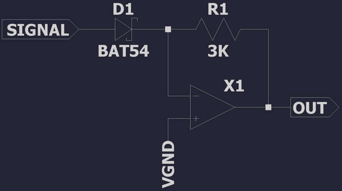

Current through R1 is:

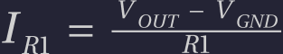

Current through D1 follows the [Shockley diode equation](https://en.wikipedia.org/wiki/Shockley_diode_equation):

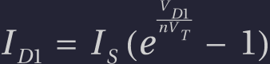

Equate the two currents and rearrange:

Disregarding all constant terms, the output voltage is an exponential of the input voltage. Here I reach the limits of my circuit analysis ability and instead quote from Wikipedia's entry on [diode small-signal behavior](https://en.wikipedia.org/wiki/Diode#Small-signal_behavior).

"In detector and mixer applications, the current can be estimated by a Taylor series. The odd terms can be omitted because they produce frequency components that are outside the pass band of the mixer or decoder. Even terms beyond the second derivative usually need not be included because they are small compared to the second order term. The desired current component is  **approximately proportional to the square of the input voltage**, so the response is called square law in this region."

For small signals, then, referenced to VGND:

We need a way to use this squaring circuit for signals of both positive and negative polarity. D1 will not conduct unless forward biased. Adding a DC bias would break the square-law behavior.

In the original circuit the diode ring D1-D4 rectifies op amp X1 and X2 outputs in different phases. This can be thought of as the four quadrants of a signed multiplication: +/+, +/-, -/+, and -/-. The goal is to perform an unsigned multiply and then apply the correct sign to the output.

Op amp X4 will sum its (squared) inputs and invert them. X3 will also do this. X3's output is fed as an input to X4, inverting it again. In effect: X4 sums and inverts its inputs, while X3 just sums its inputs.

A reminder that this is the equation being calculated, for two input signals:

When both X1 and X2 outputs, -(a + b) and -(a - b), are positive the first term is fed to X4 and the second to X3, computing the subtraction above.

The following table shows which op amps are fed by which diode, for given polarities of X1 and X2 outputs, and the direction of current flow:

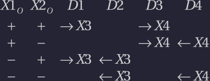

Note that a single op amp can have multiple active inputs. These voltages sum together. If current flows away from the op amp then the voltage is subtracted.

The squared terms will always be positive. However op amps X3 and X4 cannot square negative voltages since this would reverse bias their diodes. Instead these voltages are fed as a subtracted term (that is current flowing away) to the alternate op amp. For example, using the table above:

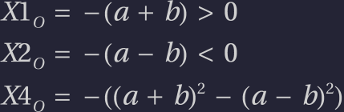

Current through D4 flows away from X4. This negates the second term in the summation. By routing positive and negative phases of each term to different op amps the equation can be calculated in all four quadrants.

Putting all of this together the final output of the circuit, referenced to VGND, is:

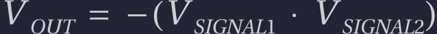

# Voltage-Controlled Resistor

A building block for several circuits is the voltage-controlled resistor. This design uses the channel resistance of a JFET to control the behavior of a circuit. By varying the gate-source voltage within a particular range the resistance changes roughly linearly from 100 to 1000 ohms.

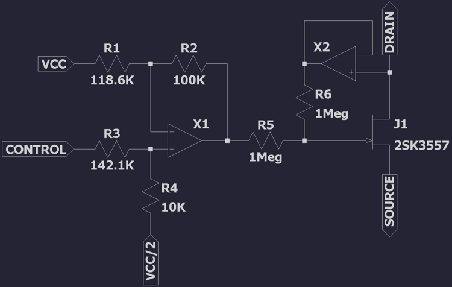

The input to this circuit, VCONTROL, ranges from 0V to VCC. A [signal offset and attenuator](#signal_offset_and_attenuator) circuit inverts and transforms this voltage into a small range. This range corresponds to the narrow linear region of a JFET's resistance curve and is different for every physical component.

The resistor values shown above are tuned for simulation. In practice every instance of the circuit is calibrated by hand.

R6 cancels a non-linear term in the resistance response by feeding back half of the drain voltage to the gate.

# Filter

SUSY implements a [state variable filter](https://en.wikipedia.org/wiki/State_variable_filter) to subtract frequency components from signals. This design combines high-pass, low-pass, and band-pass filters with just three op amps.

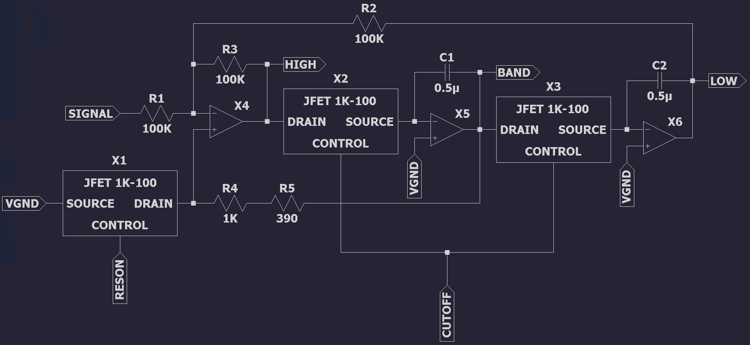

The circuit follows a normal state-variable filter construction but substitutes fixed resistors, which determine cutoff/center frequency and resonance, with [voltage-controlled resistors](#voltage-controlled_resistor).

With X2 and X3 tied to the same control voltage, the cutoff/center frequency of the filter is:

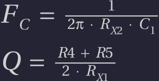

X1 and X2 resistance both vary from 100 to 1000 ohms. Thus:

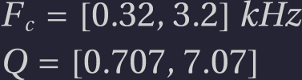

The minimum resonance gives a flat pass band response. Higher values add attenutation and gain around the cutoff frequency, for low/high-pass filters, or narrow the pass band for band-pass filters.

# Filter Switch

The filter stage outputs low-pass, high-pass, and band-pass filtered signals. The unfiltered signal is also passed through. All four signals are multiplexed through a 4-way switch to select one for output.

This is a similar design to the [oscillator switch](#oscillator_switch), using three pairs of 2-way switches. However these signals are small enough to be conducted by MOSFETs. Gate-source bias is large enough to fully conduct or block each signal.

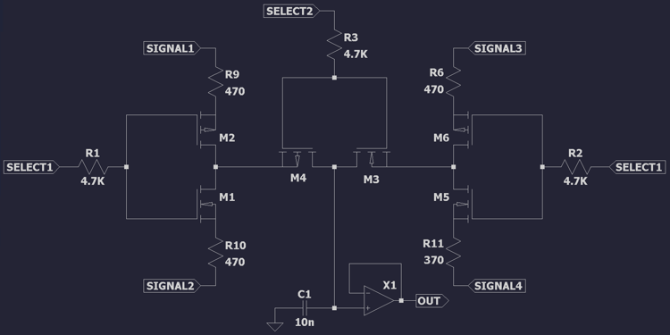

N-channel and P-channel pairs of MOSFETs pass one input and block the other. Switching noise is suppressed by a low-pass RC filter feeding the op amp buffer X1. This has a cutoff frequency of:

# Attenuator

The attenuator is built on a similar principle to the [voltage-controlled resistor](#voltage-controlled_resistor). One such design might use a VCR to vary gain in an inverting op amp configuration. However this would have very limited dynamic range: just 10:1 if we want reasonable linearity.

The chosen design has a much wider dynamic range while maintaining linearity. The input signal is 100mVpp and the output varies from 50mVpp to almost DC. At such low volumes the output can be switched off in the [line driver](#line_driver) for complete silence.

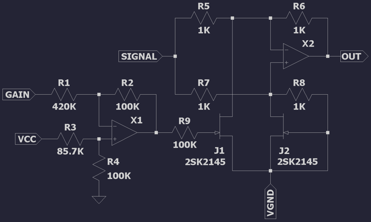

Op amp X1 performs a scale/offset transformation similar to that used in the [voltage-controlled resistor](#voltage-controlled_resistor). It maps 0V to VGND for maximum attenuation and VCC to a calibrated voltage yielding 50mVpp attenuator output. This circuit requires matched JFETs: the 2SK2145 dual-JFET proved adequate.

The low input signal swing combined with a high ratio of R5 and R7 to the JFET channel resistance ensures a very small voltage drop across the JFET drain-source. This is key to maintaining linearity in the JFET's resistance with changes in the gate voltage.

Taking J1 and J2 out of the circuit: X2 together with R5, R6, R7, and R8 form a differential amplifier relative to VGND.

The resistance of J2 is fixed at a constant minimum RMIN, due to VGS=0. J1's resistance varies from RMIN to some larger RMAX. When both J1 and J2 have resistance RMIN X2 sees the same voltage at both of its inputs. The differential is 0V and X2 outputs VGND: a fully attenuated signal.

As J1's resistance increases the differential becomes:

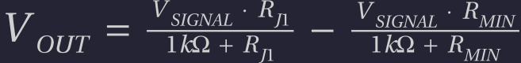

If RJ1 is substantially smaller than 1K then VOUT scales approximately linearly as J1 varies from RMIN to RMAX:

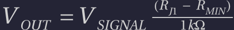

# Mixer

All four channels are multiplexed by two mixers, for left and right speakers. This is a simple op amp summing configuration. The signal is also amplified to 150mVpp for line-level output.

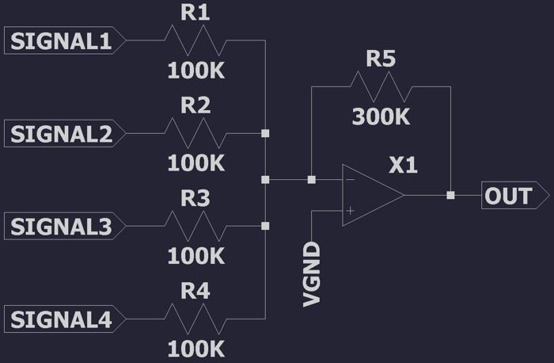

# Line Driver

The line driver feeds the stereo jack and external audio playback circuits. C1 removes the VGND offset. M1 allows output to be switched off for silence. Clipper diodes D1 and D2, with R2 limiting current, protect the line output from overvoltage.

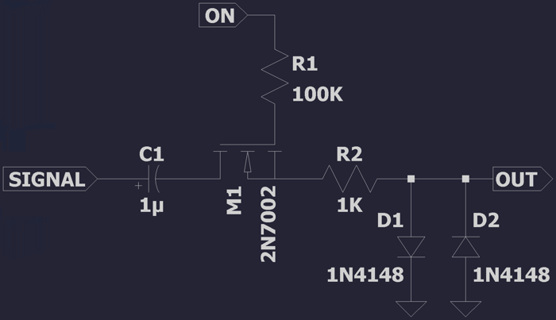

The designed load is 10K ohms. C1 with R2 and the load form a low-pass filter to suppress switching transients:

