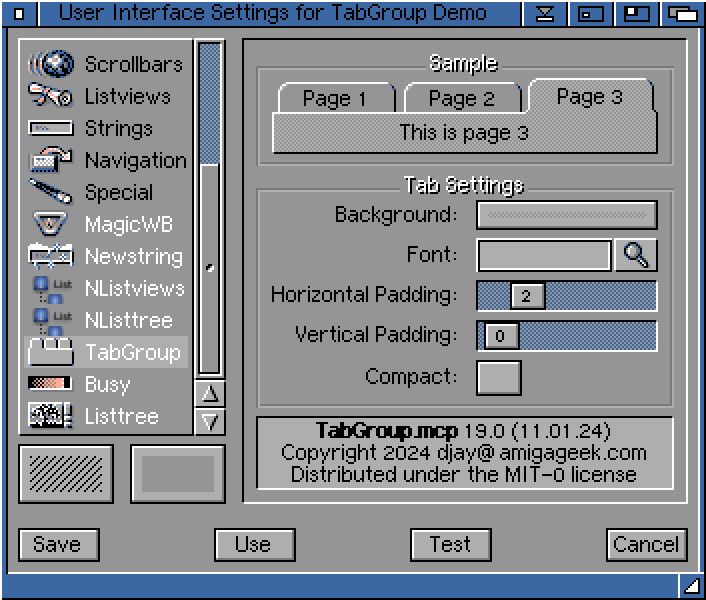

In an upcoming project I am building a [MUI](https://en.wikipedia.org/wiki/Magic_User_Interface) application which manages one document per tab. I prefer this design to managing documents in separate windows.

MUI provides a Group subclass called Register which displays each of its children on a separate page. The group has a strip of tabs along the top to identify and change pages.

Register would be a good fit were it not for one problem: the set of pages is static. As the user opens and closes documents I need to add and remove pages. This was resolved in a later version of MUI but classic Amigas generally run MUI 3.8. Later builds targeted [PPC](https://en.wikipedia.org/wiki/PowerPC) and [RTG](https://en.wikipedia.org/wiki/Retargetable_graphics) for acceptable performance.

TabGroup.mcc to the rescue! Thanks to the extensibility of MUI, and to the [BOOPSI](https://en.wikipedia.org/wiki/BOOPSI) foundation that it builds upon, I was able to adapt the Group class to fit my needs. Here is a summary of improvements I've made:

- Tabs can be added, removed, renamed, and dragged/dropped
- Display one page per tab, or the same page on all tabs
- Mimics the look and feel of the Register class
- User preferences for tab size, padding, font, and background

User preferences are implemented as a MUI settings module:

TabGroup.mcc will be released on Aminet once I have finished testing it. For now the source code and binary package are [available on GitHub](https://github.com/amigageek/mcc_tabgroup).